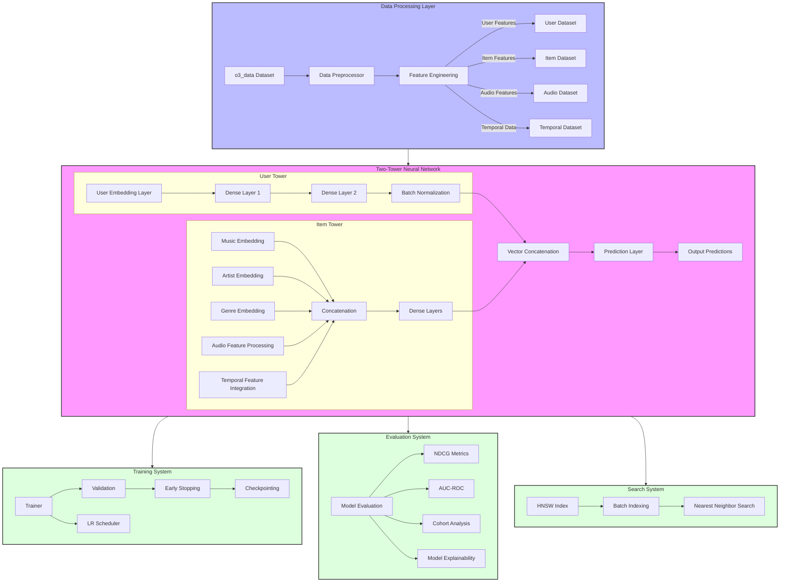

# Lhydra-Flask: Hybrid Music Recommender System

A sophisticated music recommendation system that combines collaborative filtering with content-based features using a two-tower neural network architecture. The system processes user preferences, audio features, and temporal patterns to provide personalized music recommendations.

## Project Structure

```
Lhydra-Flask/
│
├── data/                       # Data-related modules
│   ├── __init__.py
│   ├── dataset.py              # PyTorch Dataset implementation
│   ├── dataloader.py           # Data loading utilities
│   ├── preprocessor.py         # Data cleaning and feature engineering
│   └── encoders.py             # Feature encoding (simplified)
│
├── models/                     # Model implementations
│   ├── __init__.py
│   ├── base_model.py           # Abstract base class for models
│   ├── hybrid_model.py         # Main hybrid recommender model
│   └── components/             # Model components
│       ├── __init__.py
│       ├── embedding.py        # Embedding layers
│       └── attention.py        # Attention mechanisms
│
├── training/                   # Training-related code
│   ├── __init__.py
│   ├── trainer.py              # Model training logic
│   ├── metrics.py              # Evaluation metrics
│   └── loss.py                 # Loss functions
│
├── inference/                  # Inference-related code
│   ├── __init__.py
│   ├── recommender.py          # Recommendation generation
│   └── evaluation.py           # Model evaluation
│
├── utils/                      # Utility functions
│   ├── __init__.py
│   ├── config.py               # Configuration handling
│   ├── feature_engineering.py  # Feature engineering helpers
│   ├── logging.py              # Logging utilities
│   └── io.py                   # File I/O helpers
│
├── scripts/                    # Executable scripts
│   ├── prepare_data.py         # Data preparation script
│   ├── train_model.py          # Model training script
│   ├── evaluate_model.py       # Model evaluation script
│   └── generate_recommendations.py  # Generate recommendations
│
├── configs/                    # Configuration files
│   ├── default.yaml            # Default configuration
│   ├── training.yaml           # Training configuration
│   └── preprocessing.yaml      # Preprocessing configuration
│
├── README.md                   # Project documentation
├── requirements.txt            # Project dependencies
└── setup.py                    # Package installation
```

## System Architecture



## Features

- Hybrid recommendation approach combining:
  - Collaborative filtering
  - Content-based features
  - Temporal patterns
- Two-tower neural network architecture
- Support for both classification and regression tasks
- Efficient batch prediction with caching
- Comprehensive test suite
- Distributed training support
- Robust Training and Validation:
  - K-fold cross validation
  - Real-time validation metrics tracking
  - Early stopping with model checkpointing
  - Progress bars with live metric updates
- Advanced Model Evaluation:
  - Comprehensive metrics (NDCG, AUC-ROC, etc.)
  - Cohort analysis for user segments
  - Model explainability with Captum
  - Automated evaluation reports
- High-Performance Search with Spotify Voyager (https://):
  - HNSW-based similarity search
  - Efficient batch indexing
  - Memory-optimized persistence
  - Fast nearest neighbor lookup
- Robust Text Processing:
  - Advanced typo correction
  - Fuzzy string matching with sequence matcher
  - Case-insensitive handling

## Setup and Installation

1. Create a conda environment:

```bash
conda create -n Lhydra python=3.10
conda activate Lhydra
```

2. Install dependencies:

```bash
pip install -r requirements.txt
```

## Data Preparation

The system uses the `o3_data` dataset which contains:

- User information
- Item (music) features
- Artist information
- Genre information
- Audio features
- Temporal patterns

To prepare the data:

```bash
python prepare_data.py
```

This script will:

1. Load data from o3_data
2. Perform feature engineering
3. Create train/validation splits
4. Save processed datasets

## Model Training

To train the model:

```bash
python train.py
```

The training process includes:

- Mixed precision training
- Gradient accumulation
- Early stopping
- Model checkpointing
- Learning rate scheduling

## Implementation Details

### Data Preprocessing

- Feature normalization
- Temporal feature extraction
- One-hot encoding for categorical variables
- Missing value handling

### Model Architecture

1. User Tower:

   - User embedding layer
   - Age and gender processing
   - Multiple dense layers with batch normalization

2. Item Tower:

   - Item embedding layer
   - Artist and genre embeddings
   - Audio feature processing
   - Temporal feature integration

3. Prediction Layer:
   - Concatenation of user and item vectors
   - Dense layers with dropout
   - Sigmoid activation for final prediction

## Contributing

1. Follow PEP 8 style guide
2. Add tests for new features
3. Update documentation
4. Create detailed pull requests

## License

[Insert License Information]

## Contact

[Insert Contact Information]
